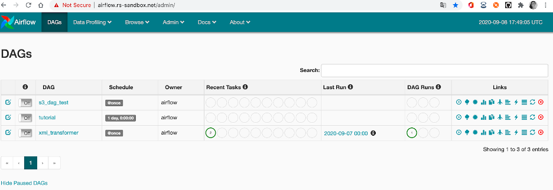
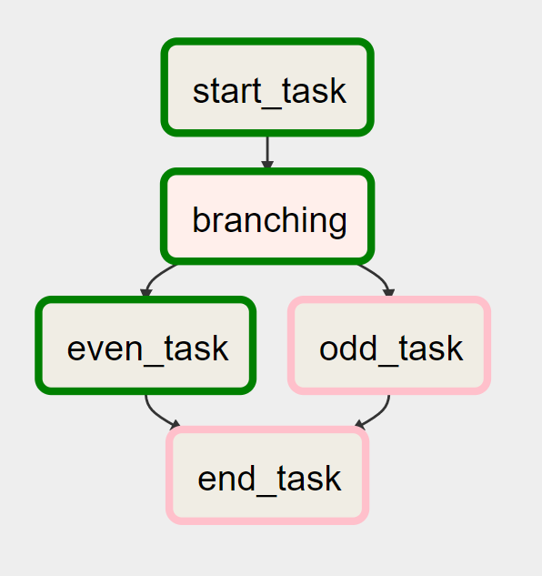

# Apache Airflow Experiments

This repo contains different experiments performed with Apache Airflow in order to validate the possibilities that this tool 
provides for creating ETL worflows. 

# What is Apache Airflow?
Airflow is a platform to programmatically author, schedule and monitor workflows as Directed Acyclic Graphs (DAGs) of tasks. The main components are: 


**Scheduler:** executes your tasks on an array of workers while following the specified dependencies.

**User interface:** visualize pipelines running in production, monitor progress, and troubleshoot issues when needed.

**Airflow executors:** Executors are the mechanism by which task instances get run. Airflow has different executors, you can them find [here](https://airflow.apache.org/docs/stable/executor/index.html). Here are the most common:

- SequentialExecutor is the default executor. The asks are executed sequentially.        
- LocalExecutor you can run locally multiple jobs in parallel. LocalExecutor runs the task on the same node as the scheduler.    
- CeleryExecutor **is the most mature option**. It requires Redis or RabbitMQ to queue the tasks.
- KubernetesExecutor was introduced in version 1.10.0. With KubernetesExecutor you can prepare different docker images for your tasks, and it gives you more flexibility.      

Since CeleryExecutor is more mature, the experiments have been executed with this architecture.   

## Airflow Architecture [With Celery Executor](https://medium.com/sicara/using-airflow-with-celery-workers-54cb5212d405)

These are the componentes of the architecture:  

- A **metadata** **database** (MySQL): it contains the status of the DAG runs and task instances.
- Airflow **web server**: a web interface to query the metadata to monitor and execute DAGs.
- Airflow **scheduler**: checks the status of the DAGs and tasks in the metadata database, create new ones if necessary and sends the tasks to the queues.
- A **message broker** (RabbitMQ): it stores the task commands to be run in queues.
- Airflow **Celery workers**: they retrieve the commands from the queues, execute them and update the metadata.


Image:https://miro.medium.com/max/2000/1*avBjYUY6ZtfEyTkk7FI8JQ.png


So, the airflow scheduler schedule the tasks through the celery executor, which enqueue the tasks in a redis queue. Each of the workers take the queued tasks to bee executed. 

All the componentes are deployed in a Kubernetes cluster. 

### Airflow Deamons
1. The **Scheduler** periodically polls to see if any of the registered DAGs need to be executed. When a DAG needs to be triggered, then the Scheduler Daemon push a message into the Queueing Service. The message contains information about the Task to be executed including the DAG Id, Task Id and what function needs to be performed.
2. A user can manually trigger DAGs using the Web Server. When a user does this, a DagRun will be created and the scheduler will send the message.
3. The **Worker daemon** pulls from the queue regularly to see if there are any tasks to be executed. When one of the celeryd processes pulls a Task message, it updates the Task's state ro Running and executes the code provided. When it finishes, the state is updated to succeeded or failed.

## DAG 

A [DAG](https://airflow.apache.org/docs/stable/concepts.html) (Directed Acyclic Graph) represents a group of tasks, which might exists dependence between them or not. It is defined as a python script, which represents the DAGs structure (tasks and their dependencies) as code.

Each of the tasks is implemented with an Operator. Different types of operator exist, and event you can create your custom operator if needed. The most common Operators are BashOperator (to execute bash actions), PythonOperator (to execute python scripts/functions) and others. In this repo different examples are provided using some of the [operators availables](https://airflow.apache.org/docs/stable/_api/airflow/operators/index.html).  


## Run locally 

You can run locally the kubernetes cluster for airflow locally with docker-compose. Downlowad this [repo](https://github.com/puckel/docker-airflow)

This docker-compose runs an airflow architecture composed by:    
	- 1 worker, scheduler       
	- flower (jobs' UI)   
	- redis (as broker)      
	- postgres (database)      

All componentes are docker containers.

**Run with celery executor:**           

```bash
docker-compose -f docker-compose-CeleryExecutor.yml up -d
```

## Run on Kubernetes 
Why? To provide more flexibility among dependencies of your workflows. Create independent tasks, each one with their dependencies and configurations.
You can check this [link](https://kubernetes.io/blog/2018/06/28/airflow-on-kubernetes-part-1-a-different-kind-of-operator/) for more information about the architecture. 


- Follow this [tutorial](https://docs.bitnami.com/tutorials/deploy-apache-airflow-kubernetes-helm/) to install airflow on kubernetes using helm. 
- If you want to run on Amazon EKS download this [tutorial](https://docs.bitnami.com/kubernetes/get-started-eks/)
- You can find in this [blog](https://towardsdatascience.com/a-journey-to-airflow-on-kubernetes-472df467f556) an introduction and an example.


## Basic Operations

**List DAGs:** In the web interface you can list all the loaded DAGs and their state. 



You can use the command line to check the configured dags: 

```bash
kubectl exec -ti airflow-worker-0 -c airflow-worker -- ls /opt/airflow/dags/dags/
```
**See logs:**

See the logs for a certgian task from the web: 
Click on the task and press the 'View Log' button. 


You can check the logs at the web interface at the DAG’s view and then click the task. There will be a bottom ‘Logs’.

You can also check the logs for the scheduler and the worker from the console:

- Execute the following command to get the id of the scheduler: 

```bash 
kubectl get pods
```

- scheduler's logs :

```bash
kubectl logs -f [pods_id] -c airflow-scheduler
```

- see worker's logs:

```bash
kubectl logs airflow-worker-0 -f airflow-worker
```

## Experiments:

 **[BashOperator](dags/test_bash_operator.py)**

This example contains 3 bash tasks, which 2 of them can execute in parallel. 
To execute this example, activate the tutorial DAG. Enter to the view for the DAG and you will see that the first task of the DAG will be scheduled and then queued to be executed.


**[PythonOperator](dags/test_python_operator.py)**

This example contains a minimal example to demonstrate usage of the Python Operator in four steps:
1. Define the DAG
2. Define the Python functions to be executed
3. Define the Python Operators
4. Configure sequence of tasks in the DAG

Python Operators allow you to run Python functions as a task in the DAG, making it simple to add automation to existing code bases in Python. Positional and keyword arguments can be passed via `op_args` and `op_kwargs` arguments when defining the tasks. The return object of the Python functions will be recorded in `airflow` logs.

**[S3FileTransformOperator](dags/test_s3_file_transform_operator.py)**

In order to run this task, we will need to install some libraries in the nodes, run inside the container: 
```bash
pip install boto3 boto botocore
```

And then, restart the container. 


This Operator is used to download a file from a s3 bucket, transform it and upload to another bucket. Therefore, in order to use this operator we need to configure a s3 connection.

In the web interface go to Admin->Connections: set the connection id and type. Add the access key and the secret key as ‘extra’ arguments.

To get the canonical user for s3: 
```bash
aws s3api list-buckets --query Owner.Ioutput text
```


In order to test the connection you can create a DAG that contains a [S3KeySensor](dags/sensor_s3.py). If the DAG is working then, you can create the [DAG](dags/test_s3_file_trainform_operator.py) with the S3FileTransformOperator.        

Setting the ``source_aws_conn_id`` and ``dest_aws_conn_id`` to the connection id in this case. In the transform_script parameter goes the complete path for the script that you want to execute to transform the file.

It is important the the script that you set in the S3FileTransformOperator starts with **#!/usr/bin/python3 **in the case of python.      

**Problem: if your script needs specific libraries to be installed (for example needs pandas), those are not installed in the worker, so when it executes the task gives you an error. For this problem there is not a clean solution, unless instead of celery you use KubernetesExecutor.**

**[AWSAthenaOperator](dags/test_aws_athena_operator.py)**

This connector allows you to make a query to Athena's database. You will need to set the s3_connection in the ``aws_conn_id`` parameter. This connection should be defined in the Connections configuration. 

**[DockerOperator](dags/test_docker_operator.py)**
When testing a docker operator, we receive an error, since it is not supported in this architecture. 
By default, DockerOperator will try to invoke the Docker API at /var/run/docker.sock but this socket is not mounted inside the worker pod, you should use the KubernetesPodOperator. 

**[KubernetesPodOperator](dags/test_kubernetes_pod_operator.py)**

This DAG executes the task into a pod, you have the option to kill the pod once it finishes the execution. 

```bash 
If you have the following error: 
{pod_launcher.py:84} ERROR - Exception when attempting to create Namespaced Pod.
```
Add in_cluster=True in the DAG in order to specify that the pod will run in the same cluster. 

**[SubdagOperator](dags/test_subdag_operator.py)**
Creates dynamically a subdag inside the dag. 

When you run it it, from the web it appears the option to enter to the subdag's information and logs:


This example list the files in a s3 bucket and for each file creates a subdag "hellow_wold_X". 


Problem: too many tasks are queued and it is probable that you will need to add more workers.  

**[Branching operator](dags/test_branching_operator.py)**

This operator allows dynamic selection of a path in a multi path DAG. In the example implementation, the branching operator selects an odd or even path. The selection of a path is convention based, that is, the value returned from the `python_callable` method is the `task_id` of the next task to run. Refer to the code for more details. Triggering the DAG multiple times will select either the odd or even path randomly, skipping the non selected path. One challenge being faced at this point is that it also skips the last task. This is still a work in progress and a PR will be created as soon as this is fixed. In the mean time, the DAG looks like the image below using the graph view on airflow webserver.



# Error and fixes:

**Error in logging:** 

```bash
Log file does not exist: /opt/airflow/logs/tutorial/print_date/2015-06-13T00:00:00+00:00/1.log
Fetching from: [http://airflow-worker-0.airflow-worker.airflow.svc.cluster.local:8793/log/tutorial/print_date/2015-06-13T00:00:00+00:00/1.log](http://airflow-worker-0.airflow-worker.airflow.svc.cluster.local:8793/log/tutorial/print_date/2015-06-13T00:00:00+00:00/1.log)
Failed to fetch log file from worker. HTTPConnectionPool(host='airflow-worker-0.airflow-worker.airflow.svc.cluster.local', port=8793): Max retries exceeded with url: /log/tutorial/print_date/2015-06-13T00:00:00+00:00/1.log (Caused by
NewConnectionError('<urllib3.connection.HTTPConnection object at 0x7f8c52d3a0b8>: Failed to establish a new connection: [Errno -2] Name or service not known',))
```
**Solution:**
Since the task were not able to fetch the log file, we had to add the following lines to the ``config_celery.yml``:

```bash
env:
      - name: AIRFLOW__CORE__HOSTNAME_CALLABLE
        value: 'airflow.utils.net:get_host_ip_address'

```
Execute:  
```bash
helm upgrade airflow stable/airflow -f config_celery.yml
```

**Restart services**

If you want to restart the scheduler or worker, just delete the pod:

```bash
kubectl delete pod [pod_id]--grace-period=0 --force
```

**Delete pods that are in Error state** 

```bash
kubectl get pods | grep Error | cut -d' ' -f 1 | xargs kubectl delete pod
```
**S3Hook**

List files: Invalid bucket name → Solution

```bash
s3.list_prefixes(bucket_name='{BUCKET_NAME}', prefix='{DATA_PATH}')
```
Problem when you create too many subdags:
```bash
INFO - max_active_runs limit for dag subdagtest.load_tasks has been reached  - waiting for other dag runs to finish
```

# TIPS For Airflow
- Lessons [**Don’t use CeleryExecutor unless you have to**]
(https://wecode.wepay.com/posts/airflow-wepay)         
- [**DAG update:**](https://www.astronomer.io/guides/dag-best-practices/) push to the configured branch to new DAG version   
- [Common errors:](https://www.astronomer.io/blog/7-common-errors-to-check-when-debugging-airflow-dag/)     
- [Best practices for testing DAGs](https://airflow.readthedocs.io/en/stable/best-practices.html)    
- [ETL principles in Airflow](https://gtoonstra.github.io/etl-with-airflow/principles.html)

**Monitoring Airflow**
- Prometheus
- Elastic search - for logs or S3
- [A series of DAGs/Workflows to help maintain the operation of Airflow:](https://github.com/teamclairvoyant/airflow-maintenance-dags)

**Use cases**       

- [https://www.benevolent.com/engineering-blog/using-airflow-with-kubernetes-at-benevolentai](https://www.benevolent.com/engineering-blog/using-airflow-with-kubernetes-at-benevolentai)
- [https://www.astronomer.io/blog/astronomer-on-astronomer-internal-use-case/](https://www.astronomer.io/blog/astronomer-on-astronomer-internal-use-case/)
- [https://blogs.halodoc.io/evolution-of-batch-data-pipeline-at-halodoc/](https://blogs.halodoc.io/evolution-of-batch-data-pipeline-at-halodoc/)
